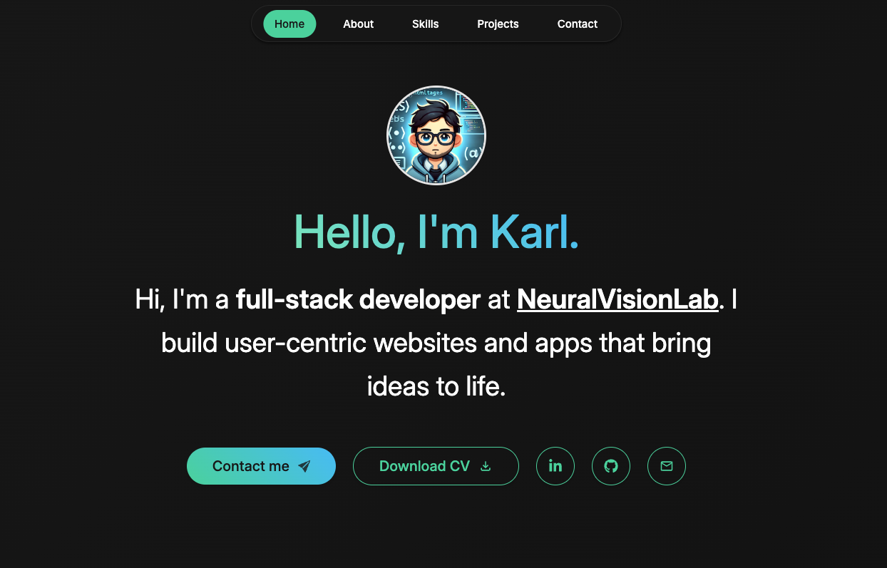

# 🌟 Karl G. - Portfolio Website

Welcome to my portfolio website! This project showcases my skills, projects, and experience as a developer. It’s built with **React**, **Vite**, and **TypeScript**, and it features a modern design with a dark theme.

🚀 **[Live Demo](https://karlg-portfolio.netlify.app/)**  
💻 **[Source Code](https://github.com/ghosnkarl/portfolio)**

---

# 📸 Screenshots

Here's a preview of the website!

---

# 🛠️ Tech Stack

- **Frameworks & Libraries:** React, Vite
- **Programming Language:** TypeScript
- **Styling:** CSS (Dark theme)
- **Animations:** Framer Motion
- **Deployment:** Netlify

---

# ✨ Features

- **Responsive Design:** Fully optimized for desktop and mobile devices.
- **Project Showcase:** A section highlighting my notable projects with live links.
- **Contact Form:** Allows visitors to reach out directly.
- **Smooth Animations:** Subtle, modern animations for enhanced user experience.

---

# 📝 License

This project is licensed under the MIT License - see the [LICENSE](https://github.com/ghosnkarl/portfolio/blob/styling_fixes/LICENSE) file for details.

---

🎉 Thank you for checking out my portfolio! Feel free to connect with me or leave feedback. 🚀
